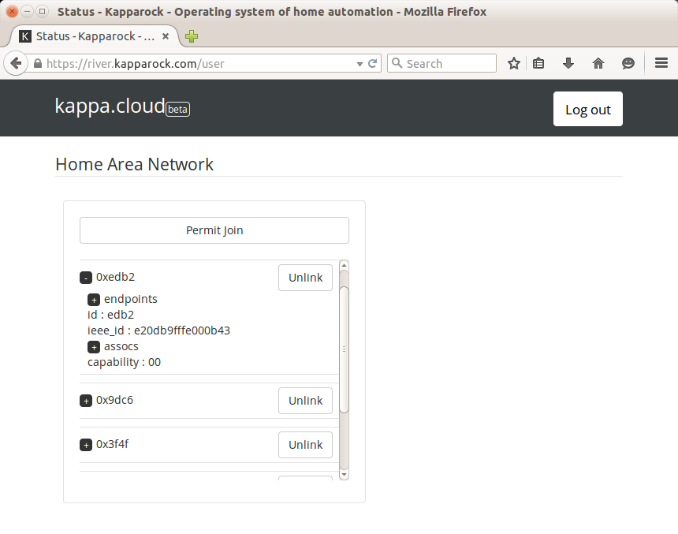

# HAN Setting
This web UI is the dashboard for controlling your HAN:
* List all connected Zigbee devices by their network address. 
* For each of devices, there is a collaps/expand space this list all of associated properties. You can also "kick" the device out of the network. For some HA devices, being kicked out means factory-reset.
* Temporary (~60 secs) allow factory-new device to join.

